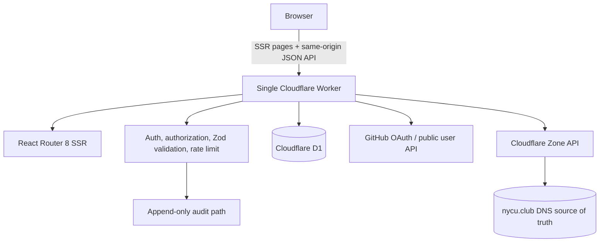

# nycu.club Domain Console

`nycu.club` 是由[交大軟體開發社](https://sdc.nycu.club)維護、部署在單一 Cloudflare Worker 的社團子網域管理平台。經授權的 GitHub 使用者可以在自己的 DNS namespace 內管理 record、Cloudflare Proxy 與 cache purge，不需要取得 Cloudflare account 或整個 zone 的 credential。

- 正式站：`https://nycu.club`
- 登入頁：`https://nycu.club/login`
- GitHub OAuth callback：`https://nycu.club/auth/github/callback`
- 語言：TypeScript（strict）、React 19、React Router 8 framework mode
- Runtime：Cloudflare Workers + React SSR + Cloudflare Vite Plugin
- 儲存：Cloudflare D1 + Drizzle ORM + versioned SQL migrations

本專案不是 generic Cloudflare proxy。Production API 只有明確列出的固定 route 與 client method，瀏覽器 bundle 不會包含 Cloudflare API Token、GitHub Client Secret、session secret 或可任意轉送的 Cloudflare path／method／body。

## 架構



Cloudflare DNS 是 DNS records 的唯一 source of truth。D1 不保存 DNS mirror，只保存：

- GitHub numeric identity、使用者狀態、admin flag 與 internal note
- canonical namespace grants
- OAuth state consumption metadata
- server-side session token hash
- immutable-through-the-application audit logs
- 公開子網域申請、審核狀態與 Discord 通知結果
- 必要的 application metadata

主要責任分層：

```text
app/lib/shared/           Workers 與 UI 共用的純驗證、DNS canonicalization、錯誤格式
app/lib/server/auth/      GitHub OAuth、PKCE、opaque session
app/lib/server/cloudflare/固定白名單 Cloudflare client
app/lib/server/db/        Drizzle schema 與 D1 client
app/lib/server/permissions/namespace、protected resource、purge 權限
app/lib/server/audit/     snapshot redaction 與 audit insert
app/lib/server/applications/申請 canonicalization、D1 寫入與管理員審核
app/lib/server/notifications/固定 Discord webhook 通知 client
app/routes/               SSR pages 與 versioned JSON API dispatcher
workers/app.ts            單一 Worker entry、request context、CSP/security headers
drizzle/                  可重現的 SQL migrations
tests/                    workerd/Vitest unit 與 integration tests
e2e/                      Playwright browser flows
```

## 權限與安全模型

### Namespace grant

Grant `magic.nycu.club` 允許：

```text
magic.nycu.club
www.magic.nycu.club
api.dev.magic.nycu.club
*.magic.nycu.club
_acme-challenge.magic.nycu.club
```

但不允許 `nycu.club`、`evilmagic.nycu.club`、`photo.nycu.club` 或 `magic.nycu.club.evil.example`。比較前會 lowercase、移除單一 trailing dot、正規化 IDNA/Punycode，並驗證 wildcard、underscore、空 label、單一 label 63 characters 與完整 FQDN 253 characters 限制。判斷使用完整 DNS label boundary：

```ts
hostname === namespace || hostname.endsWith(`.${namespace}`);
```

Grant 本身必須是 `nycu.club` 的真正子網域，不可包含 wildcard、不可等於 zone apex、不可是 protected hostname。重疊 grant 會保留最廣但仍安全的 canonical namespace。

### Admin

Admin 可以管理所有使用者與所有「非 protected」DNS/cache 資源。系統會阻止：

- 移除或停權最後一位 active admin
- 最後一位 active admin 降級自己
- 透過 UI 移除 bootstrap admin
- 非 admin 呼叫 `/api/v1/admin/*`
- 以猜測的 Cloudflare record ID 修改其他 namespace
- 將既有 record rename 到沒有權限的 namespace

任何使用者 status、admin、note 或 grant 變更會以 D1 batch 原子更新，並 revoke 該使用者所有 sessions。

### Bootstrap admin

`BOOTSTRAP_ADMIN_GITHUB_IDS` 是逗號分隔的 GitHub numeric IDs，例如：

```text
12345678,87654321
```

清單中的 identity 登入後會被提升為 active admin，且不能由 UI 移除。平台永遠不以可改名的 GitHub username 作為 bootstrap identity。

查詢 numeric ID：

```bash
curl --fail --silent --show-error \
  -H 'Accept: application/vnd.github+json' \
  https://api.github.com/users/GITHUB_USERNAME | jq '.id'
```

### GitHub OAuth 與 session

- GitHub OAuth App Web Application Flow（authorization code）
- 256-bit unpredictable `state`
- PKCE `S256`，verifier 保存在 AES-GCM 加密、10 分鐘、callback-path-scoped cookie
- D1 原子消耗 state，拒絕 expiry 與 replay
- 不要求 `repo`、organization 或其他 scope
- 只取得 numeric ID、login、name、avatar URL、profile URL
- OAuth access token 只存在於 callback call stack，讀取 `/user` 後立即捨棄
- 未知 identity 建立為 `pending`，不自動配置 grant
- suspended identity 不建立一般 session，既有 sessions 會被 revoke

正式 session cookie 是 `__Host-nycu_session`，包含至少 256-bit 原始 opaque token，設定 `Secure; HttpOnly; SameSite=Lax; Path=/` 且沒有 `Domain`。D1 只保存 SHA-256 token hash。預設效期 7 天；expired、revoked、suspended user session 都會被拒絕。

Authenticated mutation 都要求：

- authenticated active session（admin route 另驗 admin）
- 精確 `Origin === APP_ORIGIN`
- 可信 `Sec-Fetch-Site`
- HMAC-bound CSRF token
- 指定 `Content-Type`
- Zod input validation
- operation-specific rate limiter
- success 或 failure audit event

### DNS whitelist

只開放：

| Type  | 專屬驗證                                          | Proxy         |
| ----- | ------------------------------------------------- | ------------- |
| A     | IPv4、TTL                                         | 支援          |
| AAAA  | IPv6、TTL                                         | 支援          |
| CNAME | canonical target FQDN、TTL                        | 支援          |
| TXT   | 非空、最長 4096，不自動加引號                     | DNS only      |
| MX    | target、priority `0..65535`                       | 強制 DNS only |
| SRV   | service/protocol/name/priority/weight/port/target | 強制 DNS only |
| CAA   | flags、`issue`/`issuewild`/`iodef`、value         | 強制 DNS only |

TTL 支援 `1`（Auto）或 `60..86400` 秒；proxied record 必須使用 Auto。NS、DS、DNSKEY、SOA、PTR、HTTPS、SVCB、NAPTR、TLSA、SSHFP、LOC 等不在 production schema，因此即使修改前端 request 也會被拒絕。UI 的 DNS 頁會解釋各類型未開放的原因。

所有 DNS update/delete 會依序：

1. 用 record ID 從 Cloudflare 重新讀取目前 record。
2. 檢查 `PROTECTED_RECORD_IDS`。
3. 檢查目前 hostname 與 record type。
4. 依目前 hostname 授權。
5. Update 時再 canonicalize 並授權新的 hostname。
6. 通過後才呼叫 Cloudflare API。
7. Audit 保存安全化的 before/after。

### Protected records

`PROTECTED_HOSTNAMES` 是 JSON array；預設範例：

```json
["nycu.club", "www.nycu.club", "api.nycu.club", "mail.nycu.club", "_dmarc.nycu.club"]
```

`PROTECTED_RECORD_IDS` 是可選的 Cloudflare record ID JSON array。即使 admin 也不能從此平台修改 protected record；必須使用 Cloudflare Dashboard 的 break-glass 流程。

### Deep-subdomain TLS policy

`ALLOW_PROXIED_DEEP_SUBDOMAINS=false` 是安全預設。`www.magic.nycu.club`、`*.magic.nycu.club` 等多層 hostname 若開啟 Proxy，可能超出一般 full setup 的 Universal SSL coverage。預設後端會拒絕；只有確認 zone 已使用 Total TLS、Advanced Certificate 或等價憑證策略後才能設為 `true`。即使允許，UI 仍顯示憑證風險說明。

### Cache purge

- Purge URLs：建議選項，只接受 `http:`／`https:` 完整 URL，拒絕 credentials 並逐一授權 hostname。
- Purge hostnames：拒絕 wildcard、zone apex 與 protected hostname。
- Purge prefixes：使用 `hostname/path`，拒絕 scheme、port、query、hash、backslash、`.`／`..`、single/double encoded traversal。
- Purge everything：只有 admin、`ENABLE_PURGE_EVERYTHING=true`、精確輸入 `PURGE nycu.club` 並通過獨立 rate limit 才能執行。
- 不提供 cache tag purge，因為 tag 無法可靠映射到共享 zone 的單一 namespace。

### Audit 與 response

成功 response：

```json
{ "ok": true, "data": {}, "requestId": "..." }
```

失敗 response：

```json
{
	"ok": false,
	"error": { "code": "FORBIDDEN", "message": "你沒有權限管理此 hostname" },
	"requestId": "..."
}
```

Production 不回傳 stack trace。Audit snapshot 會限制深度、數量與長度，並遮蔽 authorization、cookie、secret、token、OAuth code、verifier 等欄位。一般使用者只看到自己的事件與目前 grant namespace 的 DNS/cache 事件；admin note 會從一般 API 與 SSR audit detail 遞迴移除。應用程式沒有修改或刪除 audit log 的 API。

### 子網域申請

`GET /apply` 提供不需登入的公開申請表單。`POST /apply` 只接受 bounded `application/x-www-form-urlencoded` body，並檢查 same-origin、IP rate limit、重複欄位、honeypot、GitHub login、用途長度及 canonical namespace；apex、wildcard grant、protected hostname 與非 `nycu.club` 名稱都會在伺服器端拒絕。

成功申請會寫入 D1 與 `application.submit` audit event，再以 Worker `waitUntil()` 背景通知 Discord。Webhook 失敗不會遺失申請，後台會保留 `pending`、`sent` 或 `failed` 通知狀態與安全化錯誤。管理員可從 `/admin/applications` 搜尋、篩選、更新審核狀態與 internal note；每次更新都寫入 `application.review` audit event。申請人的聯絡資料與用途不會出現在一般使用者 API。

## 前置需求

- Node.js `>=22.22.0`（CI 固定使用 22.22.0）
- pnpm 11（版本已鎖在 `packageManager`）
- Cloudflare account、Workers、D1 與 `nycu.club` zone access
- Wrangler（專案 dev dependency，使用 `pnpm exec wrangler`）
- GitHub OAuth App
- 可建立 zone-scoped Cloudflare API Token 的權限

## 初始設定

### 1. 安裝依賴

```bash
pnpm install
```

`pnpm-lock.yaml` 已提交；CI 使用 `pnpm install --frozen-lockfile`。

### 2. 建立 D1 databases

```bash
pnpm exec wrangler d1 create nycu-club
pnpm exec wrangler d1 create nycu-club-staging
```

Production `nycu-club` D1 與 `nycu.club` zone ID 已寫入 `wrangler.jsonc`。若建立 staging database，請把輸出的 `database_id` 填入 staging D1 binding；不要在可部署的環境保留全零範例 ID。

Local migration：

```bash
pnpm db:migrate:local
```

Staging / production migration：

```bash
pnpm db:migrate:staging
pnpm db:migrate:remote
```

Schema source 位於 `app/lib/server/db/schema.server.ts`，migration 位於 `drizzle/`。修改 schema 後：

```bash
pnpm db:generate --name describe_change
```

沒有需要寫入 username 的 seed。第一位 bootstrap admin 只要 numeric ID 已出現在 `BOOTSTRAP_ADMIN_GITHUB_IDS`，首次 OAuth 登入即會以 immutable GitHub ID 啟用。

### 3. 建立 GitHub OAuth Apps

Production OAuth App：

- Homepage URL：`https://nycu.club`
- Authorization callback URL：`https://nycu.club/auth/github/callback`

GitHub OAuth App 只有單一 callback URL。Local 與 staging 建議建立獨立 OAuth Apps：

- Local homepage：`http://localhost:5173`
- Local callback：`http://localhost:5173/auth/github/callback`
- Staging homepage：`https://staging.nycu.club`
- Staging callback：`https://staging.nycu.club/auth/github/callback`

平台不設定 OAuth `scope`，因此不要求 repository 或 organization 管理權。將 Client ID 與 Client Secret 設為 Worker secrets；即使 Client ID 本身不具保密性，本專案仍統一走 secret binding，避免環境設定散落。

### 4. 建立 application Cloudflare API Token

建立一個只限 `nycu.club` zone 的 token，不要使用 Global API Key。最小用途權限：

- Zone Read
- DNS Read
- DNS Write
- Cache Purge

Resources 限制為 `Include → Specific zone → nycu.club`。這個 token 是 Worker runtime 的 `CLOUDFLARE_API_TOKEN` secret；它不是 Wrangler 部署 credential。

### 5. 設定 vars 與 secrets

先編輯 `wrangler.jsonc`：

- production/staging `CLOUDFLARE_ZONE_ID`
- `BOOTSTRAP_ADMIN_GITHUB_IDS`
- `PROTECTED_HOSTNAMES`
- 可選 `PROTECTED_RECORD_IDS`
- deep TLS 與 purge-everything feature flags

Production secrets：

```bash
CLOUDFLARE_ENV=production pnpm exec wrangler secret put CLOUDFLARE_API_TOKEN
CLOUDFLARE_ENV=production pnpm exec wrangler secret put GITHUB_CLIENT_ID
CLOUDFLARE_ENV=production pnpm exec wrangler secret put GITHUB_CLIENT_SECRET
CLOUDFLARE_ENV=production pnpm exec wrangler secret put AUTH_SECRET
CLOUDFLARE_ENV=production pnpm exec wrangler secret put IP_HASH_SECRET
CLOUDFLARE_ENV=production pnpm exec wrangler secret put DISCORD_APPLICATION_WEBHOOK_URL
```

Staging 使用相同指令但改為 `CLOUDFLARE_ENV=staging`，並使用獨立 secrets。Cloudflare Vite Plugin 會在 build 時把所選環境展平成 deploy config，因此 deployment scripts 也會在 build 與 deploy 兩步都設定 `CLOUDFLARE_ENV`；不要改回只在 `wrangler deploy` 使用 `--env`。`AUTH_SECRET` 與 `IP_HASH_SECRET` 至少各 32 random bytes，兩者不可重用。可在維運終端產生：

```bash
node -e "console.log(require('node:crypto').randomBytes(32).toString('base64url'))"
```

Local：

```bash
cp .dev.vars.example .dev.vars
```

填入 local/staging OAuth App、測試用 zone-scoped token 與獨立 Discord test webhook。`.dev.vars` 已被 `.gitignore` 排除，不可提交。Production webhook URL 只能放在 Worker secret，不可寫入 `wrangler.jsonc`、GitHub Actions YAML 或前端 bundle。

> Wrangler 本身也讀取名為 `CLOUDFLARE_API_TOKEN` 的 process environment variable。執行 `wrangler secret put CLOUDFLARE_API_TOKEN` 時，shell environment 的同名值應是有 Workers deployment 權限的「部署 token」，互動提示中貼入的值才是 Worker runtime 的「應用程式 zone token」。兩者要分開建立、分開輪替。

## Local development

```bash
pnpm install
pnpm db:migrate:local
pnpm dev
```

開啟 `http://localhost:5173`。完整 OAuth login 需要 local GitHub OAuth App 與 `.dev.vars`；沒有 secret 時仍可開啟 public landing、login、安全與狀態頁。

## API surface

固定 production routes：

```text
GET  /auth/github
GET  /auth/github/callback
POST /logout
GET  /apply
POST /apply

GET  /api/v1/me
GET  /api/v1/namespaces
GET  /api/v1/sessions
POST /api/v1/sessions/revoke-others

GET    /api/v1/dns-records
POST   /api/v1/dns-records
GET    /api/v1/dns-records/:recordId
PATCH  /api/v1/dns-records/:recordId
DELETE /api/v1/dns-records/:recordId

POST /api/v1/cache/purge/urls
POST /api/v1/cache/purge/hostnames
POST /api/v1/cache/purge/prefixes
POST /api/v1/cache/purge/everything
GET  /api/v1/zone

GET   /api/v1/admin/users
POST  /api/v1/admin/github-users/resolve
POST  /api/v1/admin/users
GET   /api/v1/admin/users/:userId
PATCH /api/v1/admin/users/:userId
POST  /api/v1/admin/users/:userId/revoke-sessions
GET   /api/v1/admin/audit-logs
```

沒有接收 arbitrary upstream path 的 endpoint。

## Testing

Workers runtime unit/integration tests：

```bash
pnpm test
pnpm test:watch
```

Vitest 透過 `@cloudflare/vitest-pool-workers` 在 `workerd` 執行，正式 D1 migration 會套入每個隔離測試環境。GitHub 與 Cloudflare API 使用 fetch mocks，測試不會呼叫 production service 或要求 production token。

Playwright E2E：

```bash
pnpm exec playwright install chromium
pnpm test:e2e
```

E2E 包含 desktop/mobile public SSR、公開申請送出、login disclosure、private route redirect、pending isolation 與 versioned API authentication response。需要真實 GitHub 互動的 callback 不放入自動化 CI；OAuth state/PKCE/replay/session lifecycle 在 Workers integration test 中以受控 mock 完整驗證。

## Quality checks

```bash
pnpm format:check
pnpm lint
pnpm typecheck
pnpm test
pnpm build
```

Pull request 與 `main` push 會執行 frozen install 及以上五個 checks。一般 CI 不讀取任何 production Cloudflare Token。

## Deployment

先確認：

1. D1 IDs 與 zone ID 已替換。
2. Production vars 已依實際 protected records 與 admins 調整。
3. 六個 Worker secrets 已設定。
4. GitHub OAuth production callback 正確。
5. `nycu.club` custom domain 可由此 Worker deployment 使用。

### Cloudflare Workers Builds

Production Worker 已連接 GitHub repository `NYCU-SDC/domain`。Push 到 `main` 時，Cloudflare Workers Builds 會依序執行：

```text
pnpm format:check && pnpm lint && pnpm typecheck && pnpm test && pnpm build
pnpm exec wrangler deploy
```

Build environment 固定設定 `CLOUDFLARE_ENV=production` 與 Node.js 22，production deploy config 因此會使用 `https://nycu.club`、production D1 與 production rate-limit bindings。只有 `main` 會自動部署；`.agents/**` 與 `template/**` 不會觸發 production build。

### 手動部署與 fallback

本機手動部署：

```bash
pnpm db:migrate:remote
pnpm deploy
```

Staging：

```bash
pnpm db:migrate:staging
pnpm deploy:staging
```

`.github/workflows/deploy.yml` 保留為手動 `workflow_dispatch` fallback，需要 GitHub Environment `production` 與：

- `CLOUDFLARE_ACCOUNT_ID`
- `CLOUDFLARE_DEPLOY_API_TOKEN`：具有 Workers Scripts 與 D1 deployment/migration 所需權限

Workflow 將 `CLOUDFLARE_DEPLOY_API_TOKEN` 映射為 Wrangler process 的 `CLOUDFLARE_API_TOKEN`，不會覆寫已儲存在 Worker secret binding 的 zone-scoped application token。

## Rate limiting

`wrangler.jsonc` 提供獨立 Workers Rate Limiting bindings：

| Binding                         |                     Default |
| ------------------------------- | --------------------------: |
| `AUTH_RATE_LIMITER`             |  10 / minute / processed IP |
| `API_RATE_LIMITER`              |         120 / minute / user |
| `DNS_MUTATION_RATE_LIMITER`     |          30 / minute / user |
| `CACHE_PURGE_RATE_LIMITER`      |           5 / minute / user |
| `ADMIN_MUTATION_RATE_LIMITER`   |         30 / minute / admin |
| `PURGE_EVERYTHING_RATE_LIMITER` | 1 / minute / admin + action |

Upstream Cloudflare/GitHub 429 也會被轉成安全、可操作的 `RATE_LIMITED` response；API 回傳 `Retry-After`。

## Security headers

Worker entry 統一套用：

- nonce-based Content-Security-Policy，沒有 `unsafe-eval`
- `frame-ancestors 'none'` 與 `X-Frame-Options: DENY`
- `Referrer-Policy: strict-origin-when-cross-origin`
- `X-Content-Type-Options: nosniff`
- restrictive `Permissions-Policy`
- Cross-Origin Opener/Resource policies
- production-only HSTS
- auth、login、dashboard、admin 與 API `Cache-Control: no-store`

## 安全維運

### Token rotation

- Cloudflare application token：建立 replacement → `wrangler secret put` → 驗證 zone read/DNS/cache → revoke 舊 token。
- Deployment token：在 GitHub Environment 更新 `CLOUDFLARE_DEPLOY_API_TOKEN`，與 application token 分開輪替。
- GitHub Client Secret：在 OAuth App 產生新 secret → 更新 Worker secret → 完成登入驗證 → revoke 舊 secret。
- Discord application webhook：建立 replacement webhook → 更新 `DISCORD_APPLICATION_WEBHOOK_URL` → 送出受控測試申請並確認通知狀態 → 刪除舊 webhook。Webhook URL 若曾出現在聊天、issue、log 或 commit，應立即視為已洩漏並輪替。
- `AUTH_SECRET` rotation 會使 OAuth 暫存 cookie 與 CSRF token 失效；安排短暫重新登入窗口。
- `IP_HASH_SECRET` rotation 會中斷新舊 IP hash 的可比較性，需在 audit procedure 留下 rotation 時間。

### Admin offboarding

1. 先確保至少還有另一位 active admin。
2. 移除 grants／admin 或 suspend 使用者；平台會 revoke 其 sessions。
3. 若對方在 bootstrap list，先經 code/config review 移除 numeric ID 並部署，再於 admin UI 更新。
4. 檢查 `user.*`、`grant.*`、`session.revoke` audit events。

### Audit review

- 定期檢查 `denied`、`auth.oauth_error`、protected resource、rate limit 與 purge events。
- 用 request ID 串連 structured Worker logs 與 D1 audit。
- Audit table 沒有 application delete/update API；正式環境另依組織政策備份或匯出。

### Protected records 與 break-glass

- 將 apex、主要 web/API/mail、DMARC 與其他共享服務加入 `PROTECTED_HOSTNAMES`。
- 對無法單靠 hostname 表示的共享記錄加入 `PROTECTED_RECORD_IDS`。
- Break-glass 只透過 Cloudflare Dashboard 或獨立受控流程，操作後補登事件與原因。
- 若啟用 deep proxy，先驗證 Total TLS/Advanced Certificate coverage，再修改 `ALLOW_PROXIED_DEEP_SUBDOMAINS`。

### Status page

`/status` 是同一 Worker 提供的預設狀態入口，只能證明 Worker/SSR route 可回應。Production 應把頁面中的說明與 footer link 接到獨立於本 Worker 的外部監控／status provider，避免 outage 時失去公告通道。

## 設計決策摘要

- Runtime 只使用 Web Crypto；Node crypto 僅出現在 README 的 secret 產生命令。
- TypeScript 固定在 5.9，因目前 ESLint TypeScript parser 的 stable peer range；其餘 framework/runtime packages 使用建立時相容的最新 stable release。
- GitHub numeric ID 是 identity key；login/name/avatar 每次登入更新。
- D1 batch 用於需要一起完成的 user/grant/session revoke/audit writes。
- Cloudflare list API 明確處理 pagination，避免單頁限制漏掉 DNS records。
- No Tailwind、No Next.js、No Node server、No browser Cloudflare API calls。
